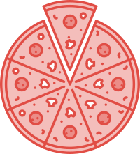

[](https://circleci.com/gh/ceduliocezar/NennosPizzaAndroid)

[](https://circleci.com/gh/ceduliocezar/NennosPizzaAndroid)
## NennosPizzaAndroid
Android client for ordering pizzas at Nenno's Pizza.

## Motivation
Create a fully tested Android application using best practices as:
- Clean Code.
- Dependency Injection.
- Reactive Programming.
- Clean Architecture.
- Test Driven Development.

## Build status

You can always check the build status on CircleCI.

[https://circleci.com/gh/ceduliocezar/NennosPizzaAndroid](https://circleci.com/gh/ceduliocezar/NennosPizzaAndroid)

## Built with

- [Dagger](https://google.github.io/dagger/): A fast dependency injector for Android and Java.
- [RxJava](https://github.com/ReactiveX/RxJava): Reactive Extensions for the JVM.
- [Glide](https://github.com/bumptech/glide): An image loading and caching library for Android focused on smooth scrolling.
- [Retrofit](http://square.github.io/retrofit/): A type-safe HTTP client for Android and Java.
- [butterknife](http://jakewharton.github.io/butterknife/): Field and method binding for Android views.

## Features
- Order pizzas.
- Order drinks.

## Building
To build this project run the following command on the root of the project.

```gradle
gradlew clean assemble
```

## Test
To run unit tests execute the following command on the root of the project.
```gradle
gradlew clean test
```

## UI Test
To run UI tests execute the following command on the root of the project.
```gradle
gradlew clean connectedAndroidTest
```

## TODO
- Create custom pizza from scratch.
- Edit a pizza from menu.
- Persist cart between app launches.
- Configure Firebase Test Lab.
- Configure CircleCI to send code coverage and static code analysis to http://sonarcloud.io/

## Contribute

If you liked the project don't be shy, submit a PR.

## Credits
This project heavily relies on concepts from:

- [Clean Code: A Handbook of Agile Software Craftsmanship](https://www.amazon.com/Clean-Code-Handbook-Software-Craftsmanship/dp/0132350882): Robert C. Martin book about writing good and readable code.
- [Ruby Midwest 2011 - Keynote: Architecture the Lost Years by Robert Martin](https://www.youtube.com/watch?v=WpkDN78P884): Robert C. Martin talk about Clean Architecture.
- [Android-CleanArchitecture](https://github.com/android10/Android-CleanArchitecture): Android application developed with concepts of clean code, architecture and tests by Fernando Cejas.
- [Test Driven Development: By Example](https://www.amazon.com/Test-Driven-Development-Kent-Beck/dp/0321146530): Kent Beck book about how to develop software guided by tests.